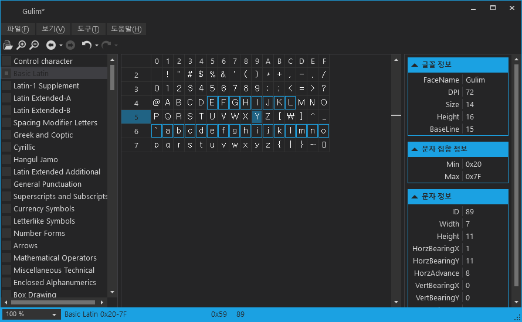
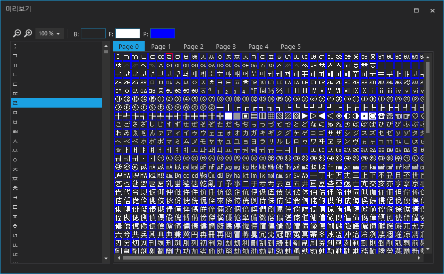

# font-generator

FreeType Based Font Texture Generator

## Development Environment

### [Microsoft Visual Studio Community 2019](https://visualstudio.microsoft.com/ko/downloads/) or [Microsoft Visual Studio Code](https://code.visualstudio.com/)

### [.NET Core 3.1](https://dotnet.microsoft.com/download/dotnet-core/3.1)

## Build an Run

    git clone https://github.com/s2quake/font-generator.git --recursive
    cd font-generator
    dotnet restore ./JSSoft.Font
    dotnet build --framework netcoreapp3.1 ./JSSoft.Font
    dotnet run --framework netcoreapp3.1 --project ./JSSoft.Font/JSSoft.Font.ApplicationHost

